# LabX — Navigation Map

LabX uses Jetpack Compose Navigation (`androidx.navigation.compose`) managed by a central `NavHost` in `MainActivity.kt`.

- **Start Destination**: `"dashboard"`
- **Architecture**: Single activity (`MainActivity`), composable screen destinations, state preservation via ViewModels and Room/DataStore.

---

## Route Map

```mermaid
flowchart TD
    Dashboard["dashboard (DashboardScreen)"]

    %% Solutions & Math
    Dashboard --> ScientificCalc["scientific_calc (ScientificCalcScreen)"]
    Dashboard --> Dilution["dilution (DilutionScreen)"]
    Dashboard --> BufferPrep["buffer_prep?name={name} (BufferPrepScreen)"]
    Dashboard --> MassMolarity["mass_molarity (MassMolarityScreen)"]
    Dashboard --> UnitConversion["unit_conversion (UnitConversionScreen)"]
    Dashboard --> ReactionSetup["reaction_setup (ReactionSetupScreen)"]

    %% Nucleic Acids
    Dashboard --> Oligo["nucleic_acid (NucleicAcidScreen)"]
    Dashboard --> DnaRnaMol["dna_rna_molarity (DnaRnaMolarityScreen)"]
    Dashboard --> NebCalc["neb_calculators (NebCalculatorsScreen)"]
    Dashboard --> PcrHub["pcr_hub (PcrHubScreen)"]
    Dashboard --> Spectroscopy["spectroscopy (SpectroscopyScreen)"]

    %% Sequence & Analysis
    Dashboard --> Needle["needle_alignment (NeedleScreen)"]
    Dashboard --> Plasmid["plasmid_viewer (SnapGeneViewerScreen)"]
    Dashboard --> Cloning["cloning (CloningParentScreen)"]
    Dashboard --> Ecology["ecology (EcologyScreen)"]

    %% Proteins & Assays
    Dashboard --> ProtParam["protparam (ProtParamScreen)"]
    Dashboard --> Protein["protein?tab={tab}&extCoeff={extCoeff}&isCystine={isCystine}&extReduced={extReduced}&extOxidized={extOxidized} (ProteinScreen)"]
    Dashboard --> SdsPage["sds_page_load (SdsPageLoadScreen)"]
    Dashboard --> Biophysical["biophysical_assay (BiophysicalAssayScreen)"]
    Dashboard --> Antibody["antibody_dilution (AntibodyDilutionScreen)"]

    %% Microscopy & Tools
    Dashboard --> CellCulture["cell_culture (CellCultureScreen)"]
    Dashboard --> Microscopy["microscopy_scale (MicroscopyScaleScreen)"]
    Dashboard --> Timers["lab_timers (LabTimersScreen)"]
    Dashboard --> Notebook["lab_notebook (LabNotebookScreen)"]
    Dashboard --> RefDb["reference_db?tab={tab} (ReferenceDbScreen)"]
    Dashboard --> ProtocolPlanner["protocol_planner (ProtocolPlannerScreen)"]
    Dashboard --> Checklist["experiment_checklist (ExperimentChecklistScreen)"]
    Dashboard --> ChecklistLib["checklist_library (ChecklistLibraryScreen)"]

    %% Internal Deep Links
    ProtParam -.->|"Send Extinction Coeff"| Protein
    Oligo -.->|"Send to PCR"| PcrHub
    PcrHub -.->|"Go to Oligo Analyzer"| Oligo
    Checklist <-->|"Switch to Library"| ChecklistLib
```

---

## Detailed Route Specifications

| Route | Composable Screen | Arguments & Defaults | Description |
| :--- | :--- | :--- | :--- |
| `dashboard` | `DashboardScreen` | None | Main hub: module grid, search bar, category reordering/renaming, backup/restore dialog |
| `scientific_calc` | `ScientificCalcScreen` | None | Arithmetic & scientific calculation with memory & history |
| `dilution` | `DilutionScreen` | None | Simple ($C_1 V_1 = C_2 V_2$), serial, fold, and percent dilution calculators |
| `buffer_prep?name={name}` | `BufferPrepScreen` | `name: String = ""` (nullable) | Buffer recipe generator, salt mass calculator, pH adjustments |
| `mass_molarity` | `MassMolarityScreen` | None | 4-way reactive solver for mass, moles, volume, and molarity with IUPAC MW calculator |
| `unit_conversion` | `UnitConversionScreen` | None | Bidirectional converter across 8 scientific measurement domains |
| `reaction_setup` | `ReactionSetupScreen` | None | Reaction pipetting manager with excess factor compensation |
| `nucleic_acid` | `NucleicAcidScreen` | None | Oligo Analyzer: sequence length, MW, GC%, SantaLucia/Xia nearest-neighbor $T_m$ |
| `dna_rna_molarity` | `DnaRnaMolarityScreen` | None | Concentration $\leftrightarrow$ molarity converter with NEB exact formulas and sequence input |
| `neb_calculators` | `NebCalculatorsScreen` | None | Mass-to-moles converter and molar ligation ratio optimizer |
| `pcr_hub` | `PcrHubScreen` | None | PCR Calculations: Master mix builder, polymerase database, thermocycling protocols |
| `spectroscopy` | `SpectroscopyScreen` | None | Beer-Lambert solver, $A_{260}$ nucleic acid quantitation, $A_{260}/A_{280}$ and $A_{260}/A_{230}$ purity |
| `needle_alignment` | `NeedleScreen` | None | EMBOSS Needle pairwise sequence alignment (Needleman-Wunsch with affine gaps) |
| `plasmid_viewer` | `SnapGeneViewerScreen` | None | SnapGene `.dna` binary plasmid parser and interactive circular/linear map |
| `cloning` | `CloningParentScreen` | None | Restriction digest simulation, Gibson assembly overlap checker, primer design |
| `ecology` | `EcologyScreen` | None | Species-abundance data entry, Shannon $H'$, Pielou $J'$, Simpson $D$, Berger-Parker $d$ |
| `protparam` | `ProtParamScreen` | None | Protein physicochemical parameters (MW, $pI$, $\epsilon_{280}$, instability, aliphatic, GRAVY) |
| `protein?tab={tab}&extCoeff={extCoeff}&isCystine={isCystine}&extReduced={extReduced}&extOxidized={extOxidized}` | `ProteinScreen` | `tab: Int = 0`, `extCoeff: Float = 0f`, `isCystine: Boolean = false`, `extReduced: Float = 0f`, `extOxidized: Float = 0f` | $A_{280}$ concentration, OLS standard curve regression, $(NH_4)_2SO_4$ precipitation |
| `sds_page_load` | `SdsPageLoadScreen` | None | SDS-PAGE lane loading volume from $A_{280}$ or $OD_{600}$ pellet normalization |
| `biophysical_assay` | `BiophysicalAssayScreen` | None | Levenberg-Marquardt non-linear curve fitting for EMSA, MST, FP, and ITC |
| `antibody_dilution` | `AntibodyDilutionScreen` | None | Primary/secondary antibody dilution calculator ($1:D$) |
| `cell_culture` | `CellCultureScreen` | None | Cell seeding density, doubling time, and vessel surface area lookup |
| `microscopy_scale` | `MicroscopyScaleScreen` | None | Micrograph scale calibration, scale bar generator, print DPI sizing |
| `lab_timers` | `LabTimersScreen` | None | Multi-channel laboratory timers and stopwatch (Foreground Service) |
| `lab_notebook` | `LabNotebookScreen` | None | Markdown protocol notebook, quick notes, experiment logs |
| `reference_db?tab={tab}` | `ReferenceDbScreen` | `tab: Int = 0` | Searchable amino acid, nucleotide, reagent, and R script reference library |
| `protocol_planner` | `ProtocolPlannerScreen` | None | Protocol timeline planner with overnight incubation scheduling |
| `experiment_checklist` | `ExperimentChecklistScreen` | None | Two-phase bench checklist (Prep & Pipetting) with master mix multiplier ($N$) |
| `checklist_library` | `ChecklistLibraryScreen` | None | Saved checklist templates and past active runs |
| `electrophoresis` | *Redirect* | None | Seamless redirect to `reference_db?tab=4` |
| `ammonium_sulfate` | *Redirect* | None | Seamless redirect to `protein?tab=2` |

---

## Inter-Module Deep Linking

- **ProtParam $\to$ Protein Calculator**: When ProtParam computes a protein's extinction coefficient ($\epsilon_{280}$), users can tap a button to navigate directly to `protein?tab=0&extCoeff=...&extReduced=...&extOxidized=...` with parameters prefilled.
- **PCR Hub $\leftrightarrow$ Oligo Analyzer**: PCR Hub links directly to `nucleic_acid` for detailed nearest-neighbor primer thermodynamic analysis.
- **Checklist $\leftrightarrow$ Checklist Library**: Seamless toggle between active experiment execution and saved template library.
